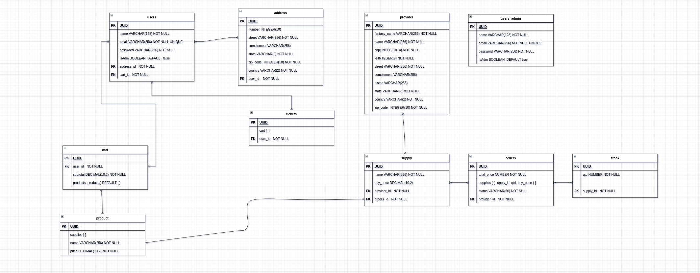

# Solid Control ⚓

## Documentação da API

## Tabela de Conteúdos:

- [Solid Control ⚓](#solid-control-)
  - [Documentação da API](#documentação-da-api)
  - [Tabela de Conteúdos:](#tabela-de-conteúdos)
  - [1. Visão Geral](#1-visão-geral)
  - [2. Diagrama ER](#2-diagrama-er)
  - [3. Início Rápido](#3-início-rápido)
    - [3.1. Instalando Dependências](#31-instalando-dependências)
    - [3.2. Variáveis de Ambiente](#32-variáveis-de-ambiente)
    - [3.3. Migrations](#33-migrations)
  - [5. Endpoints](#5-endpoints)
    - [Índice](#índice)
  - [5.1 Provider](#51-provider)

---

## 1. Visão Geral

Tecnologias usadas:

- [NodeJS](https://nodejs.org/en/)
- [Express](https://expressjs.com/pt-br/)
- [TypeScript](https://www.typescriptlang.org/)
- [PostgreSQL](https://www.postgresql.org/)
- [TypeORM](https://typeorm.io/)
- [bcrypt](https://www.npmjs.com/package/bcrypt)
- [dotenv](https://www.npmjs.com/package/dotenv)
- [JsonWebToken](https://www.npmjs.com/package/jsonwebtoken)
- [UUID](https://www.npmjs.com/package/uuid)
- [pg](https://www.npmjs.com/package/pg)
- [reflect-metadata](https://www.npmjs.com/package/reflect-metadata)
- [Commitizen](https://www.npmjs.com/package/commitizen)
- [Jest](https://www.npmjs.com/package/jest)
- [UUID-validate](https://www.npmjs.com/package/uuid-validate)

A URL base da aplicação:
https://localhost:3000/

---

## 2. Diagrama ER

[ Voltar para o topo ](#tabela-de-conteúdos)

Diagrama ER da API definindo bem as relações entre as tabelas do banco de dados.



---

## 3. Início Rápido

[ Voltar para o topo ](#tabela-de-conteúdos)

### 3.1. Instalando Dependências

Clone o projeto em sua máquina e instale as dependências com o comando:

```shell
yarn
```

### 3.2. Variáveis de Ambiente

Em seguida, crie um arquivo **.env**, copiando o formato do arquivo **.env.example**:

```
cp .env.example .env
```

Configure suas variáveis de ambiente com suas credenciais do Postgres e uma nova database da sua escolha.

### 3.3. Migrations

Execute as migrations com o comando:

```
yarn typeorm migration:run -d src/data-source.ts
```

---

## 5. Endpoints

[ Voltar para o topo ](#tabela-de-conteúdos)

### Índice

- [Users](#1-users)

  - [POST - /users](#11-criação-de-usuário)
  - [POST - /users/login](#12-fazer-login)
  - [GET - /users](#13-listando-usuários)
  - [GET - /users/:user_id](#14-listar-usuário-por-id)
  - [GET - /users/me/info](#15-listar-usuário-logado)
  - [GET - /users/me/tickets](#16-listar-feed-de-usuário-logado)
  - [PATCH - /users/:id](#17-atualizar-usuário)
  - [DELETE - /users/:id](#18-excluir-usuário)

- [Providers](#)

  - [POST - /providers](#)
  - [GET - /providers](#)
  - [GET - /providers/:provider_id](#)
  - [PATCH - /providers/:provider_id](#)
  - [DELETE - /providers/:provider_id](#)

- [Supply](#)

  - [POST - /supply](#)
  - [GET - /supply](#)
  - [GET - /supply/:supply_id](#)
  - [PATCH - /supply/:supply_id](#)
  - [DELETE - /supply/:supply_id](#)

- [Orders](#)

  - [POST - /orders](#)
  - [GET - /orders](#)
  - [GET - /orders/:order_id](#)
  - [PATCH - /orders/:order_id](#)
  - [DELETE - /orders/:order_id](#)

- [Stock](#)
  - [POST - /stock](#)
  - [GET - /stock](#)
  - [GET - /stock/:stock_id](#)
  - [PATCH - /stock/:stock_id](#)
  - [DELETE - /stock/:stock_id](#)

---

## 5.1 Provider

Todas as rotas do workflow do produto são acessadas apenas por administradores.

Provider é a tabela responsável por armazenar nossos fornecedores, o fornecedor é o primeiro cadastro obrigatório para o workflow do produto em nossa API, sem ele não será possível o relacionamento do Supply.

| Name         | Description                          | Type    |
| ------------ | ------------------------------------ | ------- |
| fantasy_name | Nome fantasia                        | string  |
| name         | Nome                                 | string  |
| cnpj         | Cadastro Nacional de Pessoa Juridica | string  |
| ie           | Inscricao estadual                   | string  |
| street       | Rua / Avenida / Travessa ou Viela    | string  |
| number       | Numero                               | nuimber |
| complement   | Complemento                          | String  |
| district     | Bairro / Distrito                    | string  |
| city         | cidade                               | string  |
| state        | Estado                               | string  |
| country      | Pais                                 | string  |
| zip_code     | Codigo postal                        | string  |
| id           | Identificador uuid                   | string  |

<br>

<span style="background:orange; color: black; font-weight: bold; padding: 2px 5px;">POST</span> **/providers**

Corpo da requisição, sendo o “complement” opcional.

```JSON
{
	"fantasy_name": "Coca Cola",
	"name": "Coca Cola Inc",
	"cnpj": "12345678901234",
	"ie": "123456789",
	"street": "Rua do Bairro",
	"number": 234,
	"complement":"Industria",
	"district": "Bairro da Cidade",
	"city": "Cidade do Estado",
	"state": "SP",
	"country":"Brasil",
	"zip_code": "02758-090"
}
```

<span style="background:blue; color: black; font-weight: bold; padding: 2px 5px;">GET</span> **/providers**

Lista todos os fornecedores cadastrados.

```JSON
[
  {
    "id": "2a6a154c-a4c3-4248-bc6c-5d98e742f71f",
    "fantasy_name": "Coca Cola",
    "name": "Coca Cola Inc",
    "cnpj": "12345678901234",
    "ie": "123456789",
    "street": "Rua do Bairro",
    "number": 234,
    "complement": "Industria",
    "district": "Bairro da Cidade",
    "city": "Cidade do Estado",
    "state": "SP",
    "country": "Brasil",
    "zip_code": "02758-090"
  }
]
```

<span style="background:blue; color: black; font-weight: bold; padding: 2px 5px;">GET</span> **/providers/:provider_id**

Lê um fornecedor específico informando o seu id na url.

```JSON

  {
    "id": "2a6a154c-a4c3-4248-bc6c-5d98e742f71f",
    "fantasy_name": "Coca Cola",
    "name": "Coca Cola Inc",
    "cnpj": "12345678901234",
    "ie": "123456789",
    "street": "Rua do Bairro",
    "number": 234,
    "complement": "Industria",
    "district": "Bairro da Cidade",
    "city": "Cidade do Estado",
    "state": "SP",
    "country": "Brasil",
    "zip_code": "02758-090"
  }

```

<span style="background:yellow; color: black; font-weight: bold; padding: 2px 5px;">PATCH</span> **/providers/:provider_id**

Permite atualizar os dados cadastrais do fornecedor.
Exemplo de corpo da requisicao.

```JSON

  {

    "name": "Coca Cola Inc"

  }

```

<span style="background:red; color: black; font-weight: bold; padding: 2px 5px;">DELETE</span> **/providers/:provider_id**

Permite deletar um fornecedor do nosso banco de dados passando seu id na url.provider
